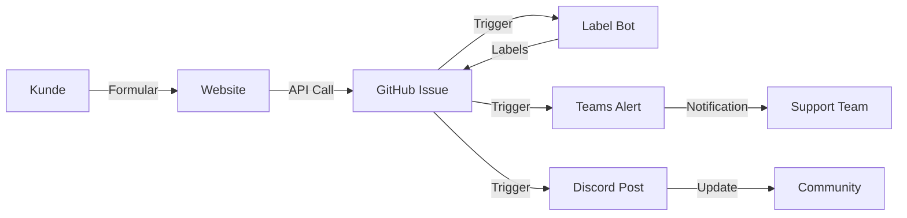

# 🚀 TechGear Store - Automation Demo

**IT Project Basics - HSLU 2025 | Gruppe 12**

Eine moderne E-Commerce-Demo mit vollautomatisierten GitHub-Workflows für Support, Labeling und Team-Notifications.

---

## 📋 Übersicht

Dieses Projekt demonstriert professionelle DevOps-Praktiken mit GitHub Actions:
- ✅ Automatisierte Support-Ticket-Erstellung
- ✅ Intelligentes Issue-Labeling
- ✅ Team-Benachrichtigungen (Teams, Discord, Slack)
- ✅ PR-Größen-Analyse
- ✅ Email-Integration

## 🌐 Live Demo

**Haupt-Website**: https://hslu-exercise.github.io/Demo-Gruppe-12/

**Automation Dashboard**: https://hslu-exercise.github.io/Demo-Gruppe-12/automation-dashboard.html

## 🏗️ Projektstruktur

```
Demo-Gruppe-12/
├── docs/                          # GitHub Pages Website
│   ├── index.html                 # TechGear Store Hauptseite
│   ├── automation-dashboard.html  # Live Workflow Dashboard
│   └── README.md                  # Website Dokumentation
│
├── .github/
│   └── workflows/                 # GitHub Actions Workflows
│       ├── label-triage-bot.yml           # Automatisches Issue-Labeling
│       ├── teams-notifications.yml        # MS Teams Alerts
│       ├── discord-notifications.yml      # Discord Updates
│       ├── slack-notifications.yml        # Slack Integration
│       ├── pr-size-labeler.yml           # PR Größen-Analyse
│       └── reusable-pr-size-labeler.yml  # Wiederverwendbarer Workflow
│
├── automations/                   # Automation Dokumentation
│   ├── label-triage-bot/
│   ├── pr-size-labeler/
│   ├── discord-notifications/
│   ├── slack-notifications/
│   └── teams-email-integration/
│
└── README.md                      # Diese Datei
```

## 🎯 Features

### 🤖 Automatisierter Support
Kunden füllen das Support-Formular auf der Website aus → GitHub Issue wird automatisch erstellt → Team wird benachrichtigt → Labels werden zugewiesen

### 🏷️ Intelligentes Labeling
- Automatische Kategorisierung nach Keywords
- Prioritäts-Erkennung (critical, high, normal)
- Expertise-basierte Zuweisung

### 📢 Multi-Channel Benachrichtigungen
- **Microsoft Teams**: Kritische Issues
- **Discord**: Community Updates
- **Slack**: Team Koordination
- **Email**: Eskalationen

### 📊 PR Management
- Automatische Größen-Berechnung (XS, S, M, L, XL)
- Review-Empfehlungen
- Code-Complexity Warnung

## 🚀 Setup & Deployment

### Voraussetzungen
- GitHub Account
- GitHub Pages aktiviert
- (Optional) Webhook URLs für Teams/Discord/Slack

### Installation

1. **Repository klonen**
```bash
git clone https://github.com/HSLU-Exercise/Demo-Gruppe-12.git
cd Demo-Gruppe-12
```

2. **GitHub Pages aktivieren**
- Settings → Pages
- Source: `main` branch, `/docs` folder
- Save

3. **Secrets konfigurieren** (für Benachrichtigungen)
```
Settings → Secrets → Actions → New repository secret

TEAMS_WEBHOOK_URL      # MS Teams Incoming Webhook
DISCORD_WEBHOOK_URL    # Discord Webhook
SLACK_WEBHOOK_URL      # Slack Webhook
SENDER_EMAIL           # Email für Benachrichtigungen
RECIPIENT_EMAIL        # Empfänger Email
```

4. **GitHub Personal Access Token** (für Support-Form)
- Ersetze `DEIN_PERSONAL_ACCESS_TOKEN_HIER_EINFUEGEN` in `docs/index.html`
- **⚠️ NUR FÜR DEMO! Produktiv Backend verwenden!**

## 📖 Verwendung

### Support-Ticket erstellen
1. Öffne die Website: https://hslu-exercise.github.io/Demo-Gruppe-12/
2. Scrolle zur Support-Sektion
3. Fülle das Formular aus
4. Issue wird automatisch erstellt & Team benachrichtigt

### Dashboard ansehen
Besuche: https://hslu-exercise.github.io/Demo-Gruppe-12/automation-dashboard.html

### Workflows testen
```bash
# Erstelle ein Test-Issue
gh issue create --title "Test" --body "Test Description" --label "bug"

# Öffne einen Test-PR
gh pr create --title "Test PR" --body "Test changes"
```

## 🛠️ Technologie-Stack

### Frontend
- **HTML5** - Semantisches Markup
- **Tailwind CSS** - Utility-first CSS Framework
- **JavaScript (ES6+)** - Interaktivität & API-Calls
- **Font Awesome** - Icons
- **Google Fonts** - Typography (Inter)

### Automation
- **GitHub Actions** - Workflow Engine
- **GitHub REST API** - Issue Management
- **Node.js** - Scripting
- **PowerShell** - Windows-Integration

### Design
- **Glassmorphism** - Modern UI Effects
- **CSS Animations** - Smooth Transitions
- **Parallax Scrolling** - Depth & Engagement
- **Responsive Design** - Mobile-First Approach

## 📊 Workflow-Architektur



## 👥 Team - Gruppe 12

- **Development**: [Namen hier einfügen]
- **Design**: [Namen hier einfügen]
- **DevOps**: [Namen hier einfügen]
- **Documentation**: [Namen hier einfügen]

## 📝 Lizenz

Dieses Projekt ist eine Demo für Bildungszwecke im Rahmen des Moduls "IT Project Basics" an der Hochschule Luzern.

## 🎓 Hochschule Luzern - IT Project Basics

**Semester**: HS 2025  
**Modul**: IT Project Basics  
**Dozent**: [Dozent Name]  
**Abgabedatum**: [Datum]

---

## 🔗 Links

- 🌐 [Live Website](https://hslu-exercise.github.io/Demo-Gruppe-12/)
- 📊 [Automation Dashboard](https://hslu-exercise.github.io/Demo-Gruppe-12/automation-dashboard.html)
- 📚 [Workflow Dokumentation](./automations/)
- 🎥 [Präsentation Guide](./docs/PRESENTATION-GUIDE.md)

---

**Made with ❤️ by Gruppe 12 | HSLU 2025**
