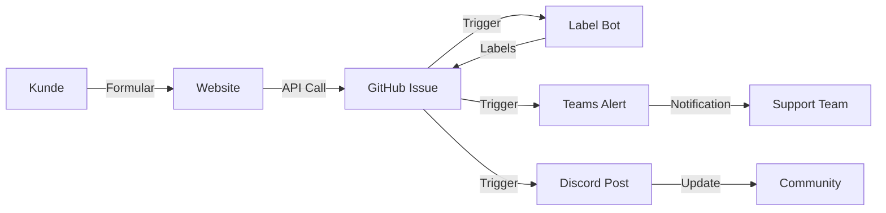

# 🚀 ImmoFlow - Intelligente Immobilienplattform

**IT Project Basics - HSLU 2025 | Gruppe 12**

Eine moderne Immobilienplattform mit vollautomatisierten GitHub-Workflows für Kundenanfragen, intelligentes Triage-System und Multi-Channel Benachrichtigungen.

[](https://dinesnimalthas.github.io/Demo-Gruppe-12/)
[](LICENSE)
[](https://github.com/dinesnimalthas/Demo-Gruppe-12/actions)
[](documentation/CONTRIBUTING.md)

## ✨ SOFORT funktionsfähig - Keine Konfiguration nötig!

```powershell
# Quick-Start Script:
.\start-demo.ps1

# Oder Website direkt öffnen:
cd docs
Start-Process index.html
```

**Demo-Modus ist aktiviert** - Support-Formular funktioniert out-of-the-box!

📖 **[→ QUICK-START Guide](documentation/QUICK-START.md)** - In 2 Minuten startklar  
🎬 **[→ LIVE-DEMO Guide](documentation/LIVE-DEMO-GUIDE.md)** - Präsentations-Anleitung  
🔐 **[→ SECRETS Dokumentation](documentation/SECRETS.md)** - Webhook-Konfiguration  
🤝 **[→ CONTRIBUTING Guide](documentation/CONTRIBUTING.md)** - Beitragen zum Projekt  
📁 **[→ REPOSITORY OVERVIEW](documentation/REPOSITORY-OVERVIEW.md)** - Vollständige Datei-Übersicht  
✅ **[→ SETUP CHECKLIST](documentation/SETUP-CHECKLIST.md)** - Komplette Setup-Anleitung

📚 **Vollständige Dokumentation**: Siehe [documentation/](documentation/) Ordner

---

## 📋 Übersicht

Dieses Projekt demonstriert professionelle DevOps-Praktiken mit GitHub Actions:
- ✅ Automatisierte Kundenanfragen-Erfassung
- ✅ Intelligentes Issue-Triage & Labeling
- ✅ Multi-Channel Benachrichtigungen (Teams, Discord, Slack)
- ✅ PR-Größen-Analyse für Code-Reviews
- ✅ KI-gestütztes Immobilien-Matching

🏠 **Use Case**: Moderne Immobilienplattform mit vollautomatisierten Workflows

## 🌐 Live Demo

**Haupt-Website**: https://dinesnimalthas.github.io/Demo-Gruppe-12/

**Automation Dashboard**: https://dinesnimalthas.github.io/Demo-Gruppe-12/automation-dashboard.html

**Use Case**: Immobilienplattform mit automatisierter Anfragenverwaltung

## 🏗️ Projektstruktur

```
Demo-Gruppe-12/
├── .github/
│   ├── workflows/                 # GitHub Actions Workflows
│   │   ├── discord-notifications.yml
│   │   ├── slack-notifications.yml
│   │   ├── teams-email-notifications.yml
│   │   ├── label-bot.yml
│   │   ├── triage-bot.yml
│   │   ├── pr-size-labeler.yml
│   │   ├── reusable-pr-size-labeler.yml
│   │   ├── labeler.yml
│   │   └── deploy-pages.yml
│   ├── ISSUE_TEMPLATE/            # Issue Templates
│   │   ├── bug_report.md
│   │   ├── feature_request.md
│   │   ├── documentation.md
│   │   ├── automation.md
│   │   └── config.yml
│   ├── PULL_REQUEST_TEMPLATE.md
│   ├── CODEOWNERS                 # Auto Reviewer Assignment
│   └── dependabot.yml             # Dependency Updates
│
├── automations/                   # Automation Dokumentation
│   ├── discord-notifications/     # Discord Integration
│   ├── slack-notifications/       # Slack Integration
│   ├── teams-email-integration/   # Teams & Email
│   ├── label-triage-bot/          # Auto Labeling
│   ├── pr-size-labeler/          # PR Size Analysis
│   └── reusable-workflow/        # Reusable Workflows
│
├── docs/                          # GitHub Pages Website
│   ├── index.html                 # ImmoFlow Hauptseite
│   ├── automation-dashboard.html  # Live Workflow Dashboard
│   ├── script.js                  # Frontend Logic
│   ├── styles.css                 # Styling
│   └── README.md                  # Website Dokumentation
│
├── documentation/                 # 📚 Projekt-Dokumentation
│   ├── README.md                  # Dokumentations-Übersicht
│   ├── QUICK-START.md             # Schnellstart-Guide
│   ├── LIVE-DEMO-GUIDE.md        # Live-Demo Anleitung
│   ├── PRAESENTATION-STRUKTUR.md # Präsentations-Ablauf
│   ├── PRESENTATION-GUIDE.md     # Detaillierte Präsentation
│   ├── SECRETS.md                 # Webhook-Konfiguration
│   ├── SECRETS-QUICKREF.md       # Secrets Quick-Ref
│   ├── SETUP-CHECKLIST.md        # Setup-Checkliste
│   ├── REPOSITORY-OVERVIEW.md    # Datei-Übersicht
│   ├── REPOSITORY-SETTINGS.md    # GitHub Settings
│   ├── CONTRIBUTING.md            # Contribution Guidelines
│   ├── SECURITY.md                # Sicherheitsrichtlinien
│   └── WAS-WURDE-HINZUGEFUEGT.md # Feature-Zusammenfassung
│
├── README.md                      # Haupt-Dokumentation
├── LICENSE                        # MIT Lizenz
├── .editorconfig                  # Editor-Konfiguration
├── .gitattributes                 # Git-Attribute
├── package.json                   # NPM-Konfiguration
└── start-demo.ps1                 # Demo-Start-Script
```

## 🎯 Features

### 🏠 Automatisierte Immobilien-Anfragen
Kunden füllen das Kontaktformular auf der Website aus → GitHub Issue wird automatisch erstellt → Team wird benachrichtigt → Labels werden zugewiesen → Prioritätsbasierte Bearbeitung

### 🏷️ Intelligentes Labeling & Triage
- **Automatische Kategorisierung** nach Keywords (Besichtigung, Finanzierung, Vertrag, etc.)
- **Prioritäts-Erkennung** (critical, high, normal)
- **Expertise-basierte Zuweisung** via CODEOWNERS
- **Welcome Messages** für First-Time Contributors

### 📢 Multi-Channel Benachrichtigungen
- **Microsoft Teams**: Kritische Anfragen & Release Notifications
- **Discord**: Community-Engagement, Immobilien-Updates
- **Slack**: Team-Koordination, Status-Updates
- **Graceful Degradation**: Funktioniert auch ohne konfigurierte Webhooks

### 📊 PR Management
- **Automatische Größen-Berechnung** (XS, S, M, L, XL)
- **Review-Empfehlungen** basierend auf Changes
- **Code-Complexity Warnung** bei großen PRs
- **Wiederverwendbarer Workflow** für andere Projekte

### 🎨 Professionelle Repository-Struktur
- **CODEOWNERS** - Automatische Reviewer-Zuweisung
- **Issue/PR Templates** - Strukturierte Eingaben
- **Dependabot** - Automatische Dependency-Updates
- **Branch Protection** - Code Quality Standards
- **Security Policy** - Verantwortungsvolle Disclosure

## 🚀 Setup & Deployment

### Voraussetzungen
- GitHub Account
- GitHub Pages aktiviert (optional)
- (Optional) Webhook URLs für Teams/Discord/Slack

### Schnellstart

```powershell
# 1. Repository klonen
git clone https://github.com/dinesnimalthas/Demo-Gruppe-12.git
cd Demo-Gruppe-12

# 2. Demo starten
.\start-demo.ps1
```

### Installation (Detailliert)

#### 1. Repository Setup
```powershell
# Fork oder Clone
git clone https://github.com/dinesnimalthas/Demo-Gruppe-12.git
cd Demo-Gruppe-12
```

#### 2. GitHub Pages aktivieren
- Gehe zu **Settings → Pages**
- Source: `main` branch, `/docs` folder
- **Save**
- Website ist verfügbar unter: `https://[username].github.io/Demo-Gruppe-12/`

#### 3. Secrets konfigurieren (Optional für Benachrichtigungen)

**Gehe zu: Settings → Secrets and variables → Actions → New repository secret**

| Secret Name | Beschreibung | Erforderlich |
|-------------|--------------|--------------|
| `DISCORD_WEBHOOK_URL` | Discord Webhook für Notifications | Optional |
| `SLACK_WEBHOOK_URL` | Slack Incoming Webhook | Optional |
| `TEAMS_WEBHOOK_URL` | Microsoft Teams Webhook | Optional |

📖 **Detaillierte Anleitung**: Siehe [SECRETS.md](documentation/SECRETS.md)

#### 4. CODEOWNERS aktivieren (Optional)
- Gehe zu **Settings → Branches**
- Branch protection rule für `main` erstellen
- Aktiviere: "Require review from Code Owners"
- Siehe [REPOSITORY-SETTINGS.md](documentation/REPOSITORY-SETTINGS.md) für Details

#### 5. Labels erstellen (Optional)

```powershell
# Automatisch mit PowerShell:
cd automations/label-triage-bot
.\create-labels.ps1

# Oder mit Node.js:
node create-labels.js
```

### Demo-Modus

**Wichtig**: Alle Workflows funktionieren auch OHNE konfigurierte Webhooks!

```javascript
// Graceful Degradation in allen Workflows:
if (!webhook) {
  console.log('⚠️ Webhook not configured - skipping notification');
  return;
}
```

Das bedeutet:
- ✅ Workflows laufen erfolgreich
- ✅ Labels werden zugewiesen
- ⚠️ Benachrichtigungen werden nur gesendet, wenn Webhooks konfiguriert sind
- 🎬 Perfekt für Live-Demos!

## 📖 Verwendung

### 🌐 Website besuchen
- **Live Website**: https://dinesnimalthas.github.io/Demo-Gruppe-12/
- **Dashboard**: https://dinesnimalthas.github.io/Demo-Gruppe-12/automation-dashboard.html

### 🏠 Immobilien-Anfrage erstellen
1. Öffne die Website
2. Scrolle zur Support-Sektion
3. Fülle das Formular aus:
   - Name & Email
   - Kategorie (Besichtigung, Finanzierung, Vertrag, etc.)
   - Beschreibung deiner Anfrage
4. Klicke "Anfrage senden"
5. ✅ Issue wird automatisch erstellt
6. 🏷️ Labels werden zugewiesen
7. 📢 Team wird benachrichtigt (wenn Webhooks konfiguriert)

### 📊 Dashboard nutzen
Das Automation Dashboard zeigt:
- Live Workflow-Status
- Anzahl aktiver Workflows
- Verwendete Technologien
- Quick-Links zu allen Automationen

### 🧪 Workflows testen

#### Mit GitHub CLI (gh)
```powershell
# Issue erstellen
gh issue create --title "Test Bug" --body "Test Description" --label "bug"

# PR erstellen
gh pr create --title "Test Feature" --body "Test changes"

# Repository öffnen
gh repo view --web
```

#### Manuell
1. Gehe zu GitHub Repository
2. Erstelle ein neues Issue → Triage Bot läuft automatisch
3. Erstelle einen PR → PR Size Labeler läuft
4. Prüfe Actions Tab für Workflow-Runs

#### Webhook Tests
```powershell
# Discord Webhook testen
.\automations\discord-notifications\test-webhook.ps1

# Slack Webhook testen
.\automations\slack-notifications\test-slack-webhook.ps1

# Teams Webhook testen
.\automations\teams-email-integration\test-teams-webhook.ps1
```

## 🛠️ Technologie-Stack

### Frontend
- **HTML5** - Semantisches Markup
- **Tailwind CSS** - Utility-first CSS Framework
- **JavaScript (ES6+)** - Interaktivität & API-Calls
- **Font Awesome** - Icons
- **Google Fonts** - Typography (Inter)

### Automation
- **GitHub Actions** - Workflow Engine
- **GitHub REST API** - Issue Management
- **Node.js** - Scripting
- **PowerShell** - Windows-Integration

### Design
- **Glassmorphism** - Modern UI Effects
- **CSS Animations** - Smooth Transitions
- **Parallax Scrolling** - Depth & Engagement
- **Responsive Design** - Mobile-First Approach

## 📊 Workflow-Architektur



## 👥 Team - Gruppe 12

- **Development**: [Namen hier einfügen]
- **Design**: [Namen hier einfügen]
- **DevOps**: [Namen hier einfügen]
- **Documentation**: [Namen hier einfügen]

## 📝 Lizenz

Dieses Projekt ist eine Demo für Bildungszwecke im Rahmen des Moduls "IT Project Basics" an der Hochschule Luzern.

## 🎓 Hochschule Luzern - IT Project Basics

**Semester**: HS 2025  
**Modul**: IT Project Basics  
**Dozent**: [Dozent Name]  
**Abgabedatum**: [Datum]

---

## 🔗 Links

- 🌐 [Live Website](https://dinesnimalthas.github.io/Demo-Gruppe-12/)
- 📊 [Automation Dashboard](https://dinesnimalthas.github.io/Demo-Gruppe-12/automation-dashboard.html)
- 📚 [Automation Dokumentation](./automations/)
- 🎬 [Live-Demo Guide](./documentation/LIVE-DEMO-GUIDE.md)
- 📖 [Quick-Start Guide](./documentation/QUICK-START.md)
- 🎤 [Präsentations-Guides](./documentation/PRAESENTATION-STRUKTUR.md)
- 🔐 [Secrets Konfiguration](./documentation/SECRETS.md)
- 🤝 [Contributing Guidelines](./documentation/CONTRIBUTING.md)
- 🛡️ [Security Policy](./documentation/SECURITY.md)
- ⚙️ [Repository Settings](./documentation/REPOSITORY-SETTINGS.md)

## 🤝 Contributing

Wir freuen uns über Beiträge! Bitte lies die [CONTRIBUTING.md](documentation/CONTRIBUTING.md) für Details.

### Schnell-Guide
1. Fork das Repository
2. Erstelle einen Feature Branch (`git checkout -b feature/AmazingFeature`)
3. Committe deine Änderungen (`git commit -m 'feat: Add AmazingFeature'`)
4. Push zum Branch (`git push origin feature/AmazingFeature`)
5. Öffne einen Pull Request

**Code Owner Review**: Pull Requests werden automatisch den richtigen Reviewern zugewiesen!

## 🐛 Bug Reports & Feature Requests

- 🐛 **Bug gefunden?** → [Bug Report Template](.github/ISSUE_TEMPLATE/bug_report.md)
- ✨ **Feature Idee?** → [Feature Request Template](.github/ISSUE_TEMPLATE/feature_request.md)
- 📚 **Dokumentation?** → [Documentation Template](.github/ISSUE_TEMPLATE/documentation.md)
- 🔧 **Automation Problem?** → [Automation Template](.github/ISSUE_TEMPLATE/automation.md)

## 🔐 Sicherheit

Sicherheitslücken bitte NICHT öffentlich melden! Kontaktiere @dinesnimalthas direkt.

Siehe [SECURITY.md](documentation/SECURITY.md) für Details.

---

**Made with ❤️ by Gruppe 12 | HSLU 2025**
